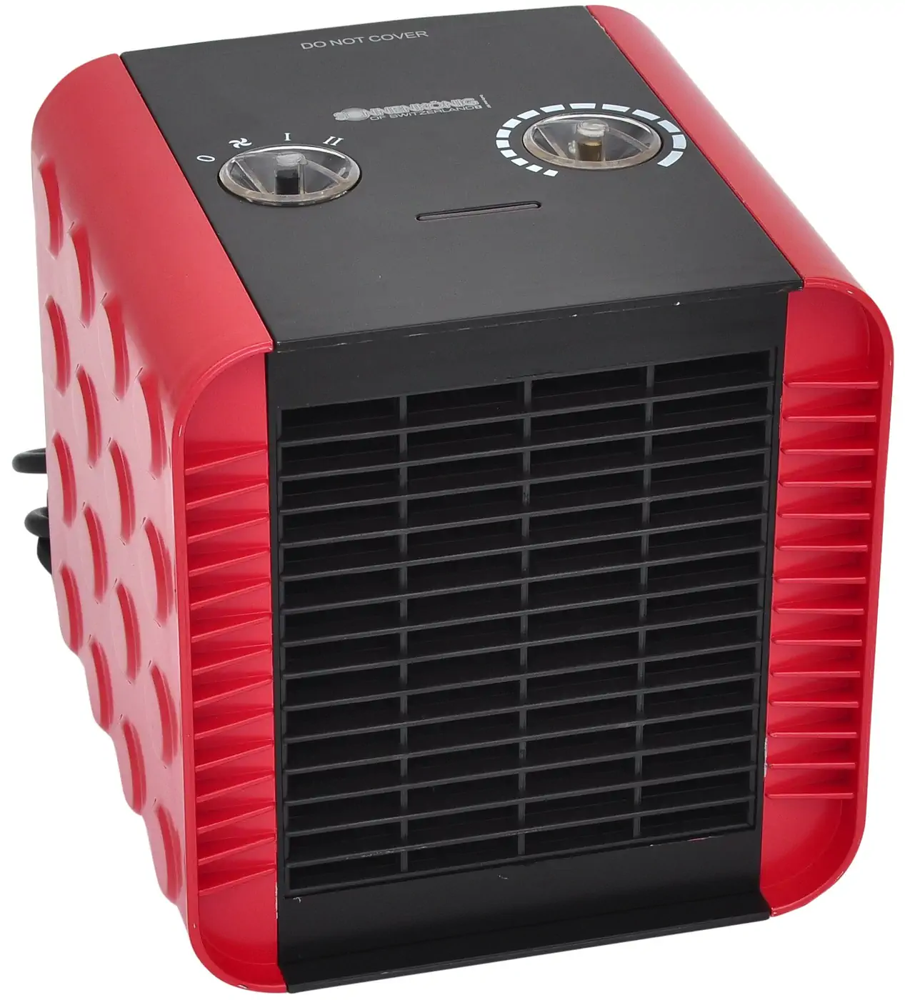

# Sonnenkönig Keramik-Heizlüfter Cuby 

 

Der kleine, kompakte Heizlüfter im Würfelformat. Hohe Heizleistung in trendigem Design, gleichzeitig sparsam und effizient, dank patentierter Keramik-Technologie. Ideal für die Übergangs-Zeit und zwischen durch. Die Vorteile des Keramikheizelements sind eine hohe Belastbarkeit und eine lange Lebensdauer. Sie haben eine sofortige Wärmeleistung, da Sie keine Anlaufzeit, wie herkömmliche Heizlüfter, benötigen. Sie haben eine sehr hohe Wärmeeffizienz und können sehr hohen Temperaturen ausgesetzt werden.

Volle Heizleistung bei weniger Stromverbrauch. Beheizen Sie Ihre Räume energiebewusst. Sie sparen mit der Linie CUBY bis zu 20% Energie! Sicherer und störungsfreier Betrieb, 78% mehr Leistung gegenüber herkömmlichen Heizkörper-Systemen. 

## Informationen
    Heizstufen 	2
    Geeignete Raumgrösse bis 	20 m²
    Nennaufnahme 	1500 W
    Nennspannung 	230 V
    Material 	Kunststoff
    Farbe 	Rot
    Gewicht 	1.6 kg
    M Garantie 	2 Jahre
    Breite 	19 cm
    Länge 	18 cm
    Höhe 	18 cm
    Anmerkung 	• Trendiges, junges Design • Keramik Heizelement • Thermostat • Kippsicherung • Überhitzungsschutz • 2 Heizstufen • 1 Ventilationsstufe 

## Preis
39.95 statt 49.95 (gekauft November 2020)