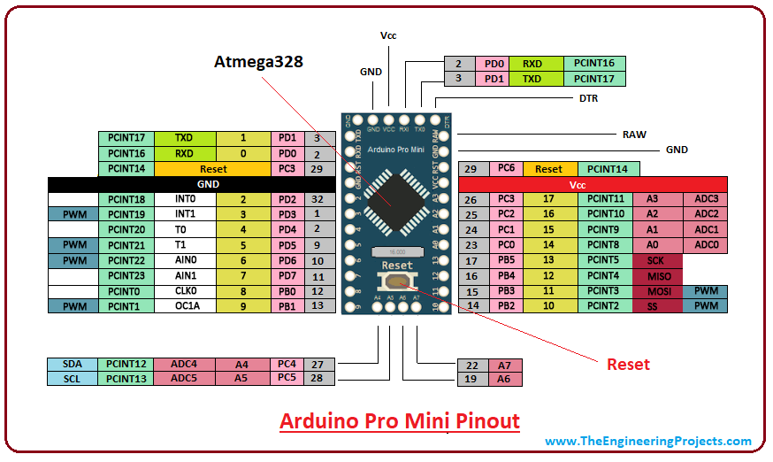

# low-noise-heating-arduino-2021
Arduino based low noise heating sketch. 
## Goal
Control fan speed and heating power on minimum needed to hold desired temperature.

# Features
* optimize fan speed to reduce noise
* temperature controller
* small OLED display (set temp, act in and out temp, fan speed)
* two keys to set temperature (increment in 0.5°C)
## Optional
* IRD function (ON/OFF, change temperature)

# Arduino board Pro mini
   

Note: GND Pin is not wired proper, check before using an clone, perhaps bridge with wire.

## programing serial interface

    DTR should also be wired
    RX and TX cross over

# work with GITHUB
start first time with 

    git clone https://github.com/ThomasZehnder/low-noise-heating-arduino-2021.git

push --> commit to GIT, pull --> get from GIT  --> Use VScode interface

    git push --set-upstream https://github.com/ThomasZehnder/low-noise-heating-arduino-2021.git master
    git pull https://github.com/ThomasZehnder/low-noise-heating-arduino-2021.git master
